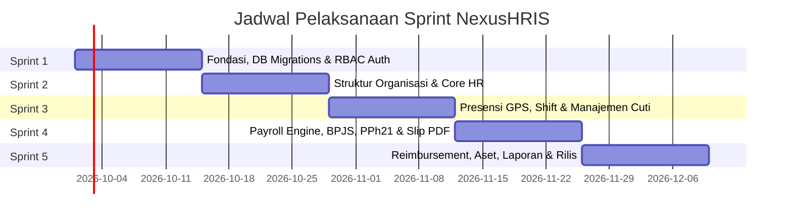

# NexusHRIS - Agile SDLC Roadmap & Product Backlog

Dokumen ini adalah panduan manajemen proyek perangkat lunak (*Software Development Life Cycle / SDLC*) berbasis kerangka kerja **Agile Scrum** untuk pengembangan sistem **NexusHRIS**. Dokumen ini memecah seluruh fitur besar (*Epics*) menjadi *User Stories*, kriteria penerimaan (*Acceptance Criteria*), dan rencana tahapan kerja (*Sprint Plan*).

---

## 1. Kerangka Kerja & Prinsip Pengembangan (Scrum Framework)

* **Metodologi:** Agile Scrum (Iteratif & Inkremental).
* **Durasi Sprint:** 2 Minggu per Sprint (Total 5 Sprint = 10 Minggu menuju produk komersial siap rilis).
* **Target Tiap Akhir Sprint:** Menghasilkan potongan software yang berfungsi (*Potentially Shippable Increment*) dan dapat langsung diuji coba.

### Definisi Selesai (Definition of Done / DoD)
Fitur dianggap selesai (*DONE*) jika memenuhi syarat berikut:
1. Kode selesai ditulis mengikuti standar PSR-12 dan clean code Laravel.
2. Validasi input dan keamanan (CSRF, XSS, otorisasi role) telah aktif.
3. Semua skenario dalam *Acceptance Criteria* lolos pengujian manual.
4. Database migration dan seeder contoh data sudah berjalan tanpa error.
5. Perubahan kode sudah di-*commit* ke repositori Git dengan pesan commit yang jelas.

---

## 2. Peta Jalan Sprint (Sprint Roadmap Overview)

---

## 3. Rincian Sprint & Product Backlog

---

### SPRINT 1: Fondasi Sistem, Database & Hak Akses (Sprint 1)
**Fokus Utama:** Menyiapkan pondasi aplikasi, autentikasi, skema database inti, dan manajemen peran pengguna (*RBAC*).

| ID Story | User Story | Prioritas | Estimasi Poin |
| :--- | :--- | :---: | :---: |
| **US-01** | Sebagai **Developer**, saya ingin melakukan instalasi dependensi, konfigurasi `.env`, dan integrasi Tailwind/Livewire agar lingkungan kerja siap digunakan. | P0 (Must Have) | 3 |
| **US-02** | Sebagai **Developer**, saya ingin menjalankan database migration lengkap sesuai `ERD.md` agar seluruh tabel relasional tercipta dengan benar. | P0 (Must Have) | 5 |
| **US-03** | Sebagai **Pengguna**, saya ingin login menggunakan email dan password agar dapat masuk ke sistem sesuai hak akses saya. | P0 (Must Have) | 3 |
| **US-04** | Sebagai **Super Admin**, saya ingin sistem memiliki 4 tingkatan hak akses (`super_admin`, `hr_admin`, `manager`, `employee`) menggunakan Spatie Laravel Permission agar akses menu terlindungi secara otomatis. | P0 (Must Have) | 5 |
| **US-05** | Sebagai **Super Admin**, saya ingin melihat log aktivitas (*audit trail*) di tabel `activity_logs` agar setiap aksi sensitif (login, hapus data) tercatat jejak digitalnya. | P1 (Should Have) | 3 |

#### Contoh Acceptance Criteria Sprint 1:
> **User Story US-03 (Login Pengguna):**
> * **Kriteria 1:** Pengguna memasukkan email & password yang terdaftar $\rightarrow$ diarahkan ke dashboard sesuai role masing-masing.
> * **Kriteria 2:** Jika kredensial salah $\rightarrow$ muncul pesan *"Email atau kata sandi tidak cocok"*.
> * **Kriteria 3:** Jika kolom `users.is_active = false` $\rightarrow$ login ditolak dengan notifikasi *"Akun Anda telah dinonaktifkan, hubungi administrator"*.

---

### SPRINT 2: Struktur Organisasi & Master Data Karyawan (Sprint 2)
**Fokus Utama:** Manajemen hierarki perusahaan, kantor cabang dengan koordinat GPS, dan profil lengkap karyawan.

| ID Story | User Story | Prioritas | Estimasi Poin |
| :--- | :--- | :---: | :---: |
| **US-06** | Sebagai **HR Admin**, saya ingin mengelola data Kantor Cabang (`branches`) lengkap dengan titik Latitude, Longitude, dan Radius Absensi (meter). | P0 (Must Have) | 3 |
| **US-07** | Sebagai **HR Admin**, saya ingin mengelola Departemen dan Jabatan (*Designations*) yang terhubung dengan cabang. | P0 (Must Have) | 3 |
| **US-08** | Sebagai **HR Admin**, saya ingin menambahkan data karyawan baru (`employees`), otomatis membuat akun login (`users`), dan menentukan atasan langsung (*manager_id*). | P0 (Must Have) | 8 |
| **US-09** | Sebagai **HR Admin**, saya ingin mengunggah berkas digital karyawan (KTP, NPWP, Ijazah, Kontrak Kerja PDF) ke tabel `employee_documents`. | P1 (Should Have) | 5 |
| **US-10** | Sebagai **Karyawan (ESS)**, saya ingin melihat dan memperbarui profil pribadi serta kontak darurat saya secara mandiri. | P1 (Should Have) | 3 |

#### Contoh Acceptance Criteria Sprint 2:
> **User Story US-08 (Input Karyawan Baru):**
> * **Kriteria 1:** NIP (`employee_code`) dan NIK KTP wajib unik (tidak boleh duplikat).
> * **Kriteria 2:** Input karyawan otomatis men-generate akun user baru dengan password default acak dan dikirimkan via email aktivasi.
> * **Kriteria 3:** Dropdown atasan langsung hanya menampilkan karyawan yang memiliki jabatan level supervisor/manager ke atas.

---

### SPRINT 3: Presensi Cerdas & Manajemen Cuti/Izin (Sprint 3)
**Fokus Utama:** Fitur absensi berbasis lokasi GPS & foto selfie, jadwal shift, dan persetujuan cuti berjenjang.

| ID Story | User Story | Prioritas | Estimasi Poin |
| :--- | :--- | :---: | :---: |
| **US-11** | Sebagai **HR Admin**, saya ingin membuat master Shift kerja (jam masuk, jam pulang, dan toleransi keterlambatan menit). | P0 (Must Have) | 3 |
| **US-12** | Sebagai **Karyawan**, saya ingin melakukan Clock-In & Clock-Out harian menggunakan verifikasi GPS dan foto selfie langsung dari browser/ponsel. | P0 (Must Have) | 8 |
| **US-13** | Sebagai **Sistem**, saya ingin otomatis menandai kehadiran sebagai `LATE` (terlambat) dan menghitung durasi menit keterlambatan jika karyawan absen melebihi batas toleransi shift. | P0 (Must Have) | 5 |
| **US-14** | Sebagai **Karyawan**, saya ingin mengajukan permohonan Cuti Tahunan atau Izin Sakit lengkap dengan upload surat dokter dan melihat sisa kuota cuti saya. | P0 (Must Have) | 5 |
| **US-15** | Sebagai **Manager & HR**, saya ingin menerima notifikasi approval permohonan cuti bawahan dan bisa melakukan *Approve* atau *Reject* disertai catatan alasan. | P0 (Must Have) | 5 |
| **US-16** | Sebagai **Karyawan**, saya ingin mengajukan surat perintah lembur (Overtime) yang diverifikasi oleh atasan langsung. | P1 (Should Have) | 5 |

#### Contoh Acceptance Criteria Sprint 3:
> **User Story US-12 (Clock-In GPS & Selfie):**
> * **Kriteria 1:** Jika tipe kerja `WFO` dan jarak GPS karyawan > nilai `radius_meters` cabang kantor $\rightarrow$ tombol absensi terkunci dan muncul peringatan jarak.
> * **Kriteria 2:** Tombol Clock-In hanya bisa diklik setelah izin kamera diberikan dan foto selfie tertangkap.
> * **Kriteria 3:** File foto selfie tersimpan di direktori storage privat yang terproteksi.

---

### SPRINT 4: Mesin Penggajian, Pajak & Slip Gaji PDF (Sprint 4)
**Fokus Utama:** Otomasi perhitungan payroll bulanan, komponen pendapatan, potongan BPJS/PPh 21, dan cetak slip gaji.

| ID Story | User Story | Prioritas | Estimasi Poin |
| :--- | :--- | :---: | :---: |
| **US-17** | Sebagai **HR Admin**, saya ingin mengatur struktur gaji karyawan (`salary_structures`) meliputi gaji pokok, tunjangan tetap, dan tunjangan makan/transport. | P0 (Must Have) | 5 |
| **US-18** | Sebagai **HR/Finance**, saya ingin menjalankan *Run Payroll Batch* bulanan yang otomatis mengalkulasi total kehadiran, potongan mangkir, jam lembur, dan cicilan kasbon. | P0 (Must Have) | 8 |
| **US-19** | Sebagai **Sistem**, saya ingin otomatis menghitung potongan iuran BPJS Ketenagakerjaan, BPJS Kesehatan, dan estimasi pajak PPh 21 sesuai regulasi yang berlaku. | P0 (Must Have) | 8 |
| **US-20** | Sebagai **HR Admin**, saya ingin mengunduh atau mencetak Slip Gaji resmi berformat PDF untuk setiap karyawan dalam satu kali klik. | P0 (Must Have) | 5 |
| **US-21** | Sebagai **Karyawan**, saya ingin melihat riwayat slip gaji bulanan dan mengunduh file PDF-nya dari dashboard saya. | P1 (Should Have) | 3 |
| **US-22** | Sebagai **Karyawan**, saya ingin mengajukan permohonan Kasbon/Pinjaman kantor dengan skema cicilan potong gaji otomatis. | P1 (Should Have) | 5 |

#### Contoh Acceptance Criteria Sprint 4:
> **User Story US-18 & US-19 (Otomasi Payroll):**
> * **Kriteria 1:** Status batch penggajian memiliki alur status: `DRAFT` $\rightarrow$ `REVIEW` $\rightarrow$ `APPROVED` $\rightarrow$ `PAID`.
> * **Kriteria 2:** Jam lembur yang dihitung HANYA data pengajuan lembur yang berstatus `APPROVED` di modul overtimes.
> * **Kriteria 3:** Setiap slip gaji menampilkan rincian jelas antara total pendapatan kotor (*Gross*), total potongan (*Deductions*), dan gaji bersih (*Take-Home Pay*).

---

### SPRINT 5: Reimbursement, Aset, Laporan & Peluncuran (Sprint 5)
**Fokus Utama:** Modul pelengkap operasional, inventaris laptop/aset, dashboard analitik eksekutif, dan ekspor laporan.

| ID Story | User Story | Prioritas | Estimasi Poin |
| :--- | :--- | :---: | :---: |
| **US-23** | Sebagai **Karyawan**, saya ingin mengajukan klaim biaya (*Reimbursement*) operasional dengan melampirkan foto struk kuitansi. | P1 (Should Have) | 5 |
| **US-24** | Sebagai **Finance**, saya ingin memverifikasi klaim biaya karyawan dan menandai status sebagai dicairkan (*Disbursed*). | P1 (Should Have) | 3 |
| **US-25** | Sebagai **HR/General Affairs**, saya ingin mencatat inventaris aset kantor (Laptop, Monitor, Kendaraan) dan log penyerahan ke karyawan (`asset_assignments`). | P1 (Should Have) | 5 |
| **US-26** | Sebagai **Executive/Management**, saya ingin melihat grafik visual di Dashboard: Rasio Kehadiran harian, Pengeluaran Payroll bulanan, dan total karyawan aktif. | P0 (Must Have) | 5 |
| **US-27** | Sebagai **HR Admin**, saya ingin mengekspor data absensi bulanan dan rekapitulasi gaji ke dalam format **Excel (.xlsx)**. | P0 (Must Have) | 5 |
| **US-28** | Sebagai **Developer**, saya ingin melakukan optimasi performa query, konfigurasi caching, dan simulasi pengujian akhir sebelum deployment. | P0 (Must Have) | 5 |

---

## 4. Alur Kerja Harian & Siklus Sprint (Agile Rituals)

Bagi seorang pengembang (baik solo developer maupun tim kecil), terapkan kebiasaan kerja ini:

1. **Sprint Planning (Awal Sprint):**
   * Pilih daftar *User Stories* dari backlog yang akan diselesaikan dalam sprint 2 minggu ke depan.
   * Pastikan skema tabel database dan controller terkait sudah dipahami.
2. **Daily Development (Harian):**
   * Kerjakan 1 user story hingga selesai tuntas (*DoD terpenuhi*) sebelum memulai story berikutnya.
   * Buat git commit spesifik per fitur (contoh: `feat(attendance): implement gps distance validation with haversine`).
3. **Sprint Review & Demo (Akhir Sprint):**
   * Buka browser dan lakukan pengujian langsung seluruh alur fitur yang telah dikerjakan pada sprint tersebut.
4. **Sprint Retrospective:**
   * Catat kendala teknis yang dihadapi dan tentukan solusi perbaikan untuk sprint berikutnya.

---

## 5. Checklist Kesiapan Peluncuran (Release Checklist)

* [ ] Seluruh migrasi database dan database seeder berjalan mulus pada database bersih.
* [ ] Proteksi otorisasi role terpasang pada seluruh route sensitif.
* [ ] Penyimpanan foto (selfie absensi, kuitansi, dokumen KTP) menggunakan storage link yang aman.
* [ ] Background queue dikonfigurasi untuk pengiriman email notifikasi dan generate PDF massal.
* [ ] Aplikasi bebas dari error debug Laravel di mode produksi (`APP_DEBUG=false`).
