# NexusHRIS - Entity-Relationship Diagram (ERD) & Database Schema

Dokumen ini mendefinisikan rancangan struktur database lengkap untuk sistem **NexusHRIS** berskala *commercial/enterprise*. Struktur ini dirancang kompatibel dengan MySQL 8.x / PostgreSQL 15+ dan arsitektur Eloquent ORM di Laravel.

---

## 1. Visualisasi ERD (Mermaid Diagram)

```mermaid
erDiagram
    %% Auth & RBAC
    USERS ||--o{ MODEL_HAS_ROLES : "assigned"
    ROLES ||--o{ MODEL_HAS_ROLES : "belongs to"
    ROLES ||--o{ ROLE_HAS_PERMISSIONS : "has"
    PERMISSIONS ||--o{ ROLE_HAS_PERMISSIONS : "belongs to"
    USERS ||--o| EMPLOYEES : "profile"
    USERS ||--o{ ACTIVITY_LOGS : "causes"

    %% Organization Structure
    BRANCHES ||--o{ DEPARTMENTS : "contains"
    DEPARTMENTS ||--o{ DESIGNATIONS : "contains"
    BRANCHES ||--o{ EMPLOYEES : "assigned to"
    DEPARTMENTS ||--o{ EMPLOYEES : "assigned to"
    DESIGNATIONS ||--o{ EMPLOYEES : "holds"
    EMPLOYEES ||--o{ EMPLOYEES : "supervises (manager_id)"

    %% Employee Sub-entities
    EMPLOYEES ||--o{ EMPLOYEE_DOCUMENTS : "stores"
    EMPLOYEES ||--o{ EMERGENCY_CONTACTS : "has"
    EMPLOYEES ||--o{ CAREER_HISTORIES : "tracks"
    EMPLOYEES ||--o{ WARNING_LETTERS : "receives"

    %% Attendance & Shifts
    SHIFTS ||--o{ EMPLOYEE_SHIFTS : "schedules"
    EMPLOYEES ||--o{ EMPLOYEE_SHIFTS : "assigned"
    EMPLOYEES ||--o{ ATTENDANCES : "records"
    SHIFTS ||--o{ ATTENDANCES : "references"
    EMPLOYEES ||--o{ OVERTIMES : "requests"
    EMPLOYEES ||--o{ OVERTIMES : "approved by (manager)"

    %% Leave Management
    LEAVE_TYPES ||--o{ LEAVE_BALANCES : "defines"
    EMPLOYEES ||--o{ LEAVE_BALANCES : "owns"
    EMPLOYEES ||--o{ LEAVE_REQUESTS : "submits"
    LEAVE_TYPES ||--o{ LEAVE_REQUESTS : "categorized by"
    LEAVE_REQUESTS ||--o{ LEAVE_APPROVALS : "tracked in"
    EMPLOYEES ||--o{ LEAVE_APPROVALS : "acted by"

    %% Payroll & Finance
    EMPLOYEES ||--o{ SALARY_STRUCTURES : "configured"
    PAYROLL_BATCHES ||--o{ PAYSLIPS : "generates"
    EMPLOYEES ||--o{ PAYSLIPS : "receives"
    PAYSLIPS ||--o{ PAYSLIP_ITEMS : "details"
    EMPLOYEES ||--o{ CASH_ADVANCES : "borrows"

    %% Reimbursements
    REIMBURSEMENT_CATEGORIES ||--o{ REIMBURSEMENTS : "categorized by"
    EMPLOYEES ||--o{ REIMBURSEMENTS : "claims"
    REIMBURSEMENTS ||--o{ REIMBURSEMENT_ATTACHMENTS : "includes"

    %% Assets
    ASSET_CATEGORIES ||--o{ ASSETS : "groups"
    ASSETS ||--o{ ASSET_ASSIGNMENTS : "tracked in"
    EMPLOYEES ||--o{ ASSET_ASSIGNMENTS : "holds"

    %% Announcements & Notifications
    USERS ||--o{ ANNOUNCEMENTS : "posts"
    USERS ||--o{ NOTIFICATIONS : "receives"

    USERS {
        bigint id PK
        string name
        string email UK
        string password
        boolean is_active
        datetime email_verified_at
        timestamps created_at
    }

    ROLES {
        bigint id PK
        string name
        string guard_name
    }

    PERMISSIONS {
        bigint id PK
        string name
        string guard_name
    }

    BRANCHES {
        bigint id PK
        string code UK
        string name
        text address
        decimal latitude
        decimal longitude
        integer radius_meters
        string timezone
    }

    DEPARTMENTS {
        bigint id PK
        bigint branch_id FK
        string code UK
        string name
        bigint manager_id FK
    }

    DESIGNATIONS {
        bigint id PK
        bigint department_id FK
        string title
        string grade_level
    }

    EMPLOYEES {
        bigint id PK
        bigint user_id FK,UK
        string employee_code UK
        string nik_ktp UK
        string npwp
        string bpjs_tk
        string bpjs_kes
        bigint branch_id FK
        bigint department_id FK
        bigint designation_id FK
        bigint manager_id FK
        string gender
        date birth_date
        string birth_place
        string phone
        enum employment_status "PKWT, PKWTT, INTERN, PROBATION"
        date join_date
        date contract_end_date
        string bank_name
        string bank_account_no
        string bank_account_holder
        string avatar_url
    }

    EMPLOYEE_DOCUMENTS {
        bigint id PK
        bigint employee_id FK
        string document_type
        string file_path
        string file_name
        date expiry_date
    }

    SHIFTS {
        bigint id PK
        string name
        time start_time
        time end_time
        integer grace_period_minutes
        boolean is_night_shift
    }

    ATTENDANCES {
        bigint id PK
        bigint employee_id FK
        bigint shift_id FK
        date date
        time clock_in
        time clock_out
        decimal in_latitude
        decimal in_longitude
        decimal out_latitude
        decimal out_longitude
        string in_selfie_path
        string out_selfie_path
        integer late_minutes
        integer early_leave_minutes
        enum work_type "WFO, WFH"
        enum status "PRESENT, LATE, ABSENT, SICK, PERMIT, HOLIDAY"
        text notes
    }

    OVERTIMES {
        bigint id PK
        bigint employee_id FK
        date date
        time start_time
        time end_time
        decimal total_hours
        text reason
        enum status "PENDING, APPROVED, REJECTED"
        bigint approved_by FK
        datetime approved_at
    }

    LEAVE_TYPES {
        bigint id PK
        string code UK
        string name
        integer default_days_per_year
        boolean is_deduct_annual
        boolean requires_attachment
    }

    LEAVE_BALANCES {
        bigint id PK
        bigint employee_id FK
        bigint leave_type_id FK
        integer year
        integer total_entitled
        integer used_days
        integer remaining_days
    }

    LEAVE_REQUESTS {
        bigint id PK
        bigint employee_id FK
        bigint leave_type_id FK
        date start_date
        date end_date
        integer total_days
        text reason
        string attachment_path
        enum status "DRAFT, PENDING, APPROVED, REJECTED, CANCELLED"
        bigint final_approved_by FK
        datetime final_approved_at
    }

    LEAVE_APPROVALS {
        bigint id PK
        bigint leave_request_id FK
        bigint approver_id FK
        integer approval_level
        enum status "PENDING, APPROVED, REJECTED"
        text remarks
        datetime acted_at
    }

    SALARY_STRUCTURES {
        bigint id PK
        bigint employee_id FK,UK
        decimal basic_salary
        decimal fixed_allowance
        decimal transport_allowance
        decimal meal_allowance
        decimal bpjs_tk_deduction
        decimal bpjs_kes_deduction
        decimal pph21_estimated
    }

    PAYROLL_BATCHES {
        bigint id PK
        string batch_number UK
        integer month
        integer year
        date cut_off_start
        date cut_off_end
        date payment_date
        decimal total_gross
        decimal total_deductions
        decimal total_net
        enum status "DRAFT, GENERATED, APPROVED, PAID"
    }

    PAYSLIPS {
        bigint id PK
        bigint payroll_batch_id FK
        bigint employee_id FK
        string slip_number UK
        decimal basic_salary
        decimal total_allowances
        decimal total_overtime_pay
        decimal total_deductions
        decimal net_salary
        string bank_account_no
        boolean is_sent_email
        datetime sent_at
    }

    PAYSLIP_ITEMS {
        bigint id PK
        bigint payslip_id FK
        string component_name
        enum component_type "EARNING, DEDUCTION"
        decimal amount
    }

    CASH_ADVANCES {
        bigint id PK
        bigint employee_id FK
        string request_number UK
        decimal amount
        text reason
        integer installment_months
        decimal monthly_deduction
        decimal remaining_amount
        enum status "PENDING, APPROVED, REJECTED, ACTIVE, PAID_OFF"
    }

    REIMBURSEMENTS {
        bigint id PK
        bigint employee_id FK
        bigint category_id FK
        string claim_number UK
        date claim_date
        decimal total_amount
        text description
        enum status "PENDING, APPROVED, REJECTED, DISBURSED"
        bigint approved_by FK
        datetime disbursed_at
    }

    ASSETS {
        bigint id PK
        bigint category_id FK
        string asset_tag UK
        string name
        string serial_number
        decimal purchase_cost
        date purchase_date
        enum condition "EXCELLENT, GOOD, DAMAGED, LOST"
        enum status "AVAILABLE, ASSIGNED, UNDER_MAINTENANCE, DISPOSED"
    }

    ASSET_ASSIGNMENTS {
        bigint id PK
        bigint asset_id FK
        bigint employee_id FK
        date assigned_date
        date returned_date
        enum return_condition "EXCELLENT, GOOD, DAMAGED"
        text notes
    }
```

---

## 2. Kamus Data & Spesifikasi Tabel (Data Dictionary)

### A. Modul Hak Akses & Pengguna (Auth & RBAC)
1. **`users`**: Akun login aplikasi.
   * `id` (BIGINT, PK, Auto Increment)
   * `name` (VARCHAR 255): Nama pengguna.
   * `email` (VARCHAR 255, UNIQUE): Email login.
   * `password` (VARCHAR 255): Hash password (Bcrypt/Argon2).
   * `is_active` (BOOLEAN, default: true): Status akun aktif / dinonaktifkan.
   * `remember_token`, `created_at`, `updated_at`.
2. **`roles`**, **`permissions`**, **`model_has_roles`**, **`role_has_permissions`**: Standar implementasi RBAC (kompatibel penuh dengan package Spatie Laravel Permission).
   * Role bawaan: `super_admin`, `hr_manager`, `hr_staff`, `line_manager`, `employee`.
3. **`activity_logs`**: Rekam jejak audit keamanan (*audit trail*).
   * `user_id`, `event` (created, updated, deleted, login, export), `ip_address`, `user_agent`, `old_values` (JSON), `new_values` (JSON).

---

### B. Modul Organisasi & Kantor (Organization Hierarchy)
1. **`branches`**: Kantor pusat / kantor cabang.
   * `code` (VARCHAR 50, UNIQUE): Contoh: `JKT-HQ`, `SBY-01`.
   * `name` (VARCHAR 100): Nama cabang.
   * `latitude`, `longitude` (DECIMAL 10,8): Titik koordinat GPS kantor.
   * `radius_meters` (INT, default 50): Jarak toleransi absensi (meter).
   * `timezone` (VARCHAR 50, default: `Asia/Jakarta`).
2. **`departments`**: Departemen/Divisi kerja (misal: HR, Finance, IT, Sales).
   * `branch_id` (FK -> `branches.id`).
   * `code` (VARCHAR 50, UNIQUE).
   * `name` (VARCHAR 100).
   * `manager_id` (FK -> `employees.id`, NULLABLE): Kepala departemen.
3. **`designations`**: Jabatan kerja dan grade level.
   * `department_id` (FK -> `departments.id`).
   * `title` (VARCHAR 100): Misal: *Senior Backend Developer*.
   * `grade_level` (VARCHAR 20): Misal: *L3, L4, Managerial*.

---

### C. Modul Data Karyawan (Core Employee)
1. **`employees`**: Informasi utama kepegawaian.
   * `user_id` (BIGINT, FK -> `users.id`, UNIQUE): Relasi 1-to-1 dengan akun user.
   * `employee_code` (VARCHAR 50, UNIQUE): NIP perusahaan (contoh: `EMP-2026-001`).
   * `nik_ktp` (VARCHAR 16, UNIQUE): KTP 16 digit.
   * `npwp`, `bpjs_tk`, `bpjs_kes` (VARCHAR 50): Nomor identitas jaminan & pajak.
   * `branch_id`, `department_id`, `designation_id` (FKs).
   * `manager_id` (BIGINT, FK -> `employees.id`, NULLABLE): Atasan langsung (*self-referential FK* untuk alur approval).
   * `employment_status` (ENUM: `PKWT`, `PKWTT`, `INTERN`, `PROBATION`).
   * `join_date` (DATE), `contract_end_date` (DATE, NULLABLE).
   * `bank_name`, `bank_account_no`, `bank_account_holder`: Data rekening penggajian.
2. **`employee_documents`**: Arsip berkas digital.
   * `employee_id` (FK -> `employees.id`).
   * `document_type` (ENUM: `KTP`, `NPWP`, `IJAZAH`, `KONTRAK`, `CV`, `SERTIFIKAT`).
   * `file_path`, `file_name`, `expiry_date`.
3. **`career_histories`**: Riwayat promosi, mutasi divisi, atau penyesuaian gaji.
4. **`warning_letters`**: Catatan Surat Peringatan (SP 1, SP 2, SP 3) beserta tanggal berlaku & berkas scan.

---

### D. Modul Presensi & Lembur (Attendance & Overtime)
1. **`shifts`**: Konfigurasi jam kerja.
   * `name` (VARCHAR 50): Misal: *Reguler Office, Shift Pagi, Shift Malam*.
   * `start_time` (TIME), `end_time` (TIME).
   * `grace_period_minutes` (INT, default 15): Toleransi keterlambatan.
2. **`employee_shifts`**: Penugasan shift karyawan harian/mingguan.
3. **`attendances`**: Log presensi harian karyawan.
   * `employee_id` (FK -> `employees.id`), `shift_id` (FK -> `shifts.id`).
   * `date` (DATE).
   * `clock_in` (TIME), `clock_out` (TIME).
   * `in_latitude`, `in_longitude`, `out_latitude`, `out_longitude`: Koordinat absensi real-time.
   * `in_selfie_path`, `out_selfie_path`: Foto selfie bukti kehadiran.
   * `late_minutes` (INT): Durasi telat (otomatis dihitung).
   * `early_leave_minutes` (INT): Durasi pulang cepat.
   * `work_type` (ENUM: `WFO`, `WFH`).
   * `status` (ENUM: `PRESENT`, `LATE`, `ABSENT`, `SICK`, `PERMIT`, `HOLIDAY`).
4. **`overtimes`**: Pengajuan dan persetujuan lembur.
   * `date`, `start_time`, `end_time`, `total_hours` (DECIMAL 4,2).
   * `reason` (TEXT), `status` (ENUM: `PENDING`, `APPROVED`, `REJECTED`).
   * `approved_by` (FK -> `employees.id`), `approved_at` (DATETIME).

---

### E. Modul Cuti & Izin (Leave & Time-Off)
1. **`leave_types`**: Master jenis cuti (*Annual, Maternity, Marriage, Sick, Compassionate*).
2. **`leave_balances`**: Kuota sisa cuti tahunan per karyawan (diperbarui otomatis setiap tahun).
3. **`leave_requests`**: Formulir pengajuan cuti/izin.
   * `employee_id`, `leave_type_id`, `start_date`, `end_date`, `total_days`.
   * `reason` (TEXT), `attachment_path` (Surat dokter jika izin sakit).
   * `status` (ENUM: `DRAFT`, `PENDING`, `APPROVED`, `REJECTED`, `CANCELLED`).
4. **`leave_approvals`**: Catatan riwayat persetujuan bertingkat (*Manager $\rightarrow$ HR*).

---

### F. Modul Penggajian (Payroll Engine)
1. **`salary_structures`**: Konfigurasi dasar gaji per karyawan (gaji pokok, tunjangan tetap, potongan rutin).
2. **`payroll_batches`**: Master periode penggajian bulanan (misal: Batch 2026-09).
   * `month`, `year`, `cut_off_start`, `cut_off_end`, `payment_date`.
   * `total_gross`, `total_deductions`, `total_net`, `status` (`DRAFT`, `GENERATED`, `APPROVED`, `PAID`).
3. **`payslips`**: Rekap slip gaji individu karyawan dalam 1 batch.
   * `basic_salary`, `total_allowances`, `total_overtime_pay`, `total_deductions`, `net_salary`.
   * `is_sent_email` (BOOLEAN), `sent_at` (DATETIME).
4. **`payslip_items`**: Rincian baris pendapatan & potongan pada slip gaji:
   * Tipe `EARNING`: Gaji Pokok, Tunjangan Makan, Tunjangan Transport, Uang Lembur, Insentif.
   * Tipe `DEDUCTION`: BPJS Kesehatan (1%), BPJS Ketenagakerjaan (2%), Potongan Keterlambatan, PPh 21, Cicilan Kasbon.
5. **`cash_advances`**: Pinjaman kantor / kasbon karyawan dan jadwal autodebet bulanan.

---

### G. Modul Klaim Biaya (Reimbursements)
1. **`reimbursement_categories`**: Transport, Medical, Meeting, Operational.
2. **`reimbursements`**: Pengajuan klaim (nomor klaim, tanggal, total nominal, status, approved_by).
3. **`reimbursement_attachments`**: Foto struk nota / bukti transfer fisik.

---

### H. Modul Inventaris & Aset (Asset Tracking)
1. **`assets`**: Data aset kantor (Nomor tag barcode/RFID, nama barang, serial number, kondisi fisik, status).
2. **`asset_assignments`**: Log riwayat peminjaman laptop/aset ke karyawan, tanggal penyerahan, dan tanggal pengembalian saat offboarding.
