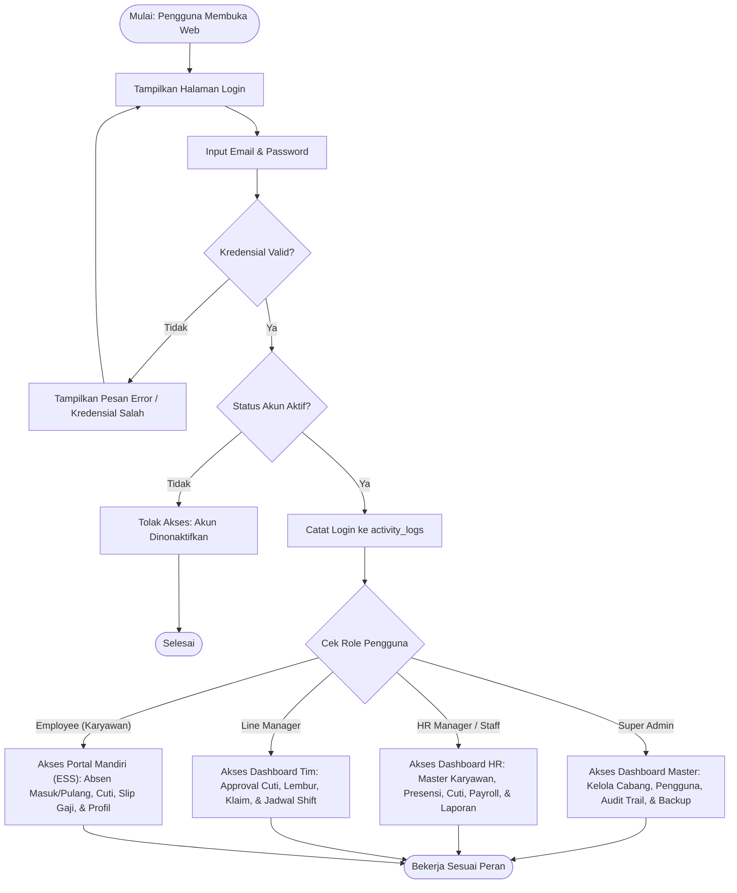
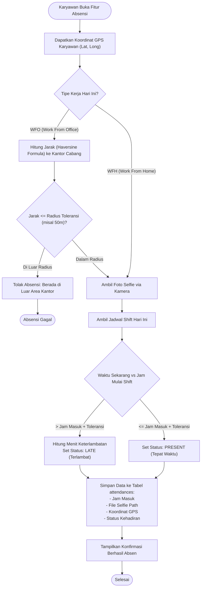
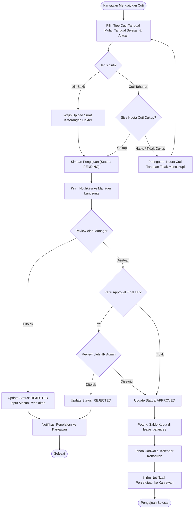
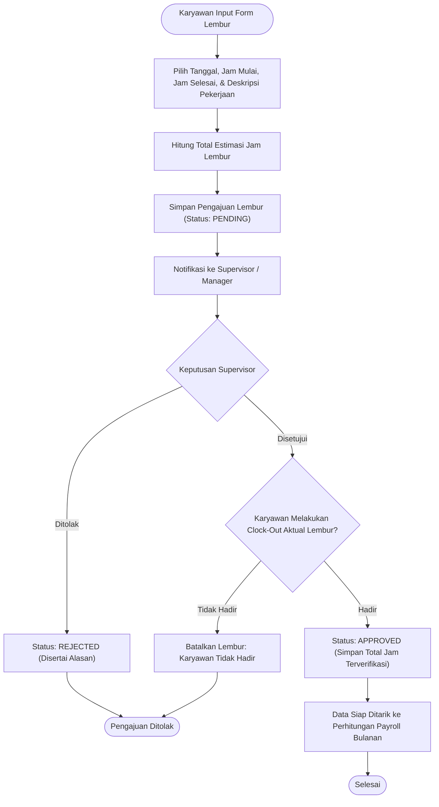
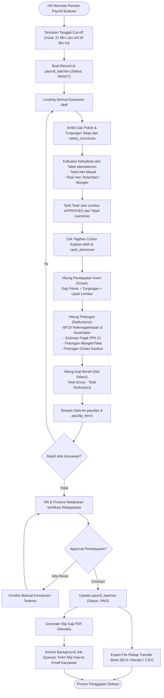
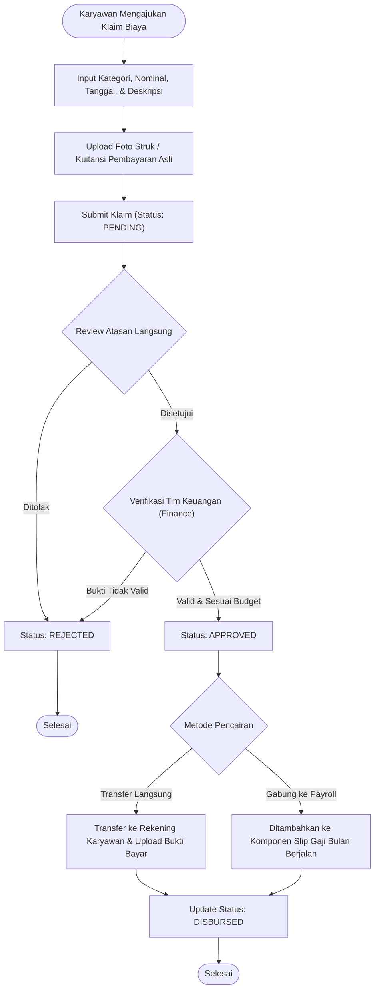
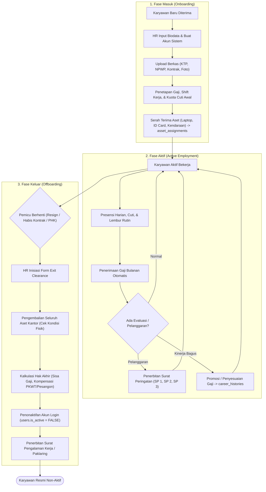

# NexusHRIS - System Architecture & Business Process Flowcharts

Dokumen ini berisi diagram alur logika bisnis (*Business Process Flowcharts*) menyeluruh untuk aplikasi **NexusHRIS**. Semua diagram dirancang menggunakan format **Mermaid** standar sehingga dapat divisualisasikan langsung di VS Code, GitHub, maupun viewer Markdown lainnya.

---

## Daftar Isi Diagram
1. [Flowchart 1: Alur Login & Hak Akses Berdasarkan Peran (RBAC)](#1-alur-login--hak-akses-rbac)
2. [Flowchart 2: Alur Presensi Cerdas (Smart Attendance - GPS & Selfie)](#2-alur-presensi-cerdas-gps--selfie)
3. [Flowchart 3: Alur Pengajuan Cuti & Izin Bertingkat (Leave Approval)](#3-alur-pengajuan-cuti--izin-bertingkat)
4. [Flowchart 4: Alur Pengajuan Lembur (Overtime Workflow)](#4-alur-pengajuan-lembur-overtime)
5. [Flowchart 5: Mesin Otomasi Penggajian Bulanan (Monthly Payroll Engine)](#5-mesin-otomasi-penggajian-bulanan-payroll-engine)
6. [Flowchart 6: Alur Klaim Biaya (Reimbursement) & Kasbon](#6-alur-klaim-biaya-reimbursement--kasbon)
7. [Flowchart 7: Siklus Hidup Karyawan (Employee Lifecycle: Onboarding hingga Offboarding)](#7-siklus-hidup-karyawan-employee-lifecycle)

---

## 1. Alur Login & Hak Akses (RBAC)

Alur penentuan hak akses pengguna saat autentikasi masuk ke sistem.

---

## 2. Alur Presensi Cerdas (GPS & Selfie)

Alur absensi masuk (*Clock-In*) dengan validasi geolokasi radius kantor dan foto wajah.

---

## 3. Alur Pengajuan Cuti & Izin Bertingkat

Alur pengajuan cuti karyawan dengan verifikasi kuota dan persetujuan multi-level.

---

## 4. Alur Pengajuan Lembur (Overtime)

Alur verifikasi lembur kerja yang akan otomatis dikonversikan ke komponen upah payroll.

---

## 5. Mesin Otomasi Penggajian Bulanan (Payroll Engine)

Siklus pemrosesan gaji karyawan secara massal setiap akhir periode *cut-off*.

---

## 6. Alur Klaim Biaya (Reimbursement) & Kasbon

Alur klaim pengeluaran operasional kerja dan pinjaman dana darurat.

---

## 7. Siklus Hidup Karyawan (Employee Lifecycle)

Alur lengkap sejak onboarding hingga serah terima aset saat offboarding.

